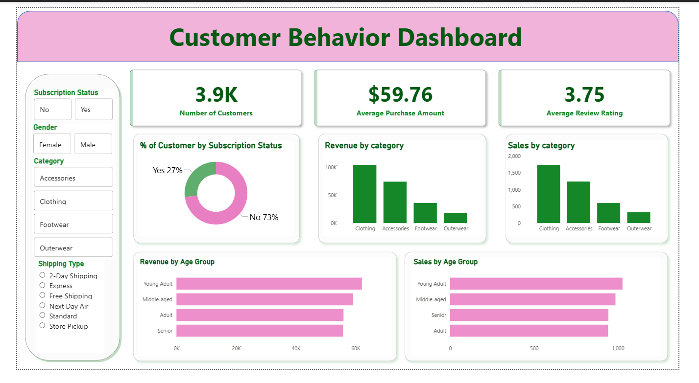

# Customer Shopping Behavior Analysis (Python, SQL, PowerBI)

## Project Overview
This project simulates a **corporate-grade, end-to-end data analytics workflow** for a retail business.  
The objective is to transform raw customer transaction data into **actionable business insights** that support strategic decision-making.

The analysis focuses on understanding **customer segments, purchase drivers, loyalty patterns, and revenue trends** using **Python, SQL, and Power BI**.

---

## Power BI Dashboard Preview

---

## Business Problem
A retail company wants to better understand customer shopping behavior in order to:

- Improve sales performance  
- Increase customer engagement and loyalty  
- Optimize marketing and product strategies  

### Key Areas of Interest
- Demographics and customer segments  
- Product categories and purchasing trends  
- Discounts, subscriptions, and repeat purchases  
- Revenue contribution across different customer groups  

### Core Business Question
**How can the company leverage consumer shopping data to identify trends, improve customer engagement, and optimize marketing and product strategies?**

---

## Dataset Overview
- **Total Records:** 3,900 transactions  
- **Total Columns:** 18  

### Key Features
- **Customer demographics:** age, gender, location, subscription status  
- **Purchase details:** item, category, price, season, size, color  
- **Behavioral metrics:** discounts, promo usage, previous purchases, purchase frequency, review ratings, shipping type  

### Missing Data
- 37 missing values in the `review_rating` column  

---

## Tools & Technologies
- **Python:** pandas, NumPy (data cleaning and feature engineering)  
- **SQL:** PostgreSQL (business queries and analysis)  
- **Power BI:** interactive dashboard and visualization  
- **Jupyter Notebook:** analysis workflow  
- **GitHub:** version control and project documentation  

---

## Project Workflow

### 1. Data Preparation & Exploratory Analysis (Python)
- Loaded and explored the dataset using pandas  
- Standardized column names for readability  
- Handled missing values in `review_rating` using median imputation by category  
- Created new features:
  - `age_group` (Young Adult, Adult, Middle-aged, Senior)  
  - `purchase_frequency_days` derived from purchase frequency  
- Checked data consistency and removed redundant columns  
- Prepared the cleaned dataset for SQL analysis  

---

### 2. Data Analysis (SQL)
The cleaned dataset was loaded into PostgreSQL to simulate real-world business analysis.

**Key questions answered:**
- Revenue comparison by gender  
- High-spending customers who used discounts  
- Top 5 products by average review rating  
- Purchase behavior by shipping type  
- Subscriber vs non-subscriber spending patterns  
- Discount dependency by product  
- Customer segmentation (New, Returning, Loyal)  
- Top products within each category  
- Relationship between repeat purchases and subscriptions  
- Revenue contribution by age group  

All queries were written with a **business-first mindset**, focusing on insights rather than syntax.

---

### 3. Visualization & Dashboard (Power BI)
An interactive Power BI dashboard was created to present insights clearly to stakeholders.

**Dashboard Highlights:**
- Total customers and average purchase value  
- Revenue by product category  
- Subscription vs non-subscription split  
- Sales and revenue by age group  
- Customer filters by category, shipping type, and subscription status  

The dashboard enables **quick exploration and data-driven decision-making**.

---

## Key Insights
- Subscribers generate higher long-term value despite similar average purchase amounts  
- Loyal customers form the largest segment, highlighting retention opportunities  
- Certain products rely heavily on discounts, impacting margins  
- Middle-aged and young adult customers contribute the most revenue  
- Express shipping customers tend to spend slightly more per purchase  

---

## Business Recommendations
- Promote subscription benefits to increase long-term revenue  
- Introduce loyalty programs for high-repeat customers  
- Optimize discount strategies to protect margins  
- Highlight top-rated and high-performing products in marketing campaigns  
- Focus marketing efforts on high-revenue customer segments  

---

## Repository Guide
- `customer_shopping_behavior_analysis.ipynb` – Data cleaning & feature engineering (Python)  
- `customer_behavior_analysis_sql.sql` – Business SQL queries  
- `customer_behavior_dashboard.pbix` – Interactive Power BI dashboard  
- `customer_behavior_dashboard_image.png` – Dashboard snapshot  
- `Report Presentation.pptx` – Business presentation  
- `customer_shopping_behavior.csv` – Raw dataset  

---

## Notes
This project uses **simulated retail data** to demonstrate real-world analytics workflows and business decision-making.
